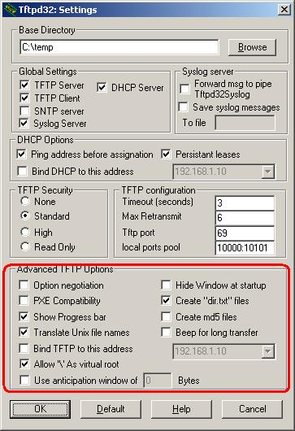

# Settings

The settings window helps you to configure the services you need.

# Tftpd setup

* Base directory
The default directory used by the TFTP client and server. It may be changed from the main window.
* Global Settings
Enable or disable tftpd32 servers and clients.
* TFTP security
	* **NONE**   read and write requests are allowed on all disks/directories (not recommended !!)
	* **Standard**  read and write requests are allowed but limited to the current directory. 
	* **High**  idem standard + write requests are allowed only if the input file exists and is empty. 
	* **Read_only**    idem standard + write requests are rejected. 

* TFTP Configuration
	* **Timeout**                                        The maximum timeout between two retransmissions 
	* **Max Retransmit**    The maximum retransmission for the same packet 
	* **Tftp Port**    The port used to listen incoming requests 
	* **local ports pool**    A range of ports (for example 3000:3030). These ports are used for the file transfers. 

* TFTP advanced Configuration
	* **Option Negotiation**    Enables the negotiation between client and server (RFC 2347) 
	* **PXE compatibility**    Enables only the file size negotiation 
	* **Show progress Bar**    Creates a gauge window for each transfer 
	* **Translate Unix file names**    Translates any slash characters to a backslash 
	* **Bind Tftpd32 to this address**    Enables TFTP only on one interface 
	* **Allow '\' As virtual root**    A file name beginning with '\' points to the TFTP directory and not to the root of the disk 
	* **Use anticipation window of ??? bytes**    Tftpd32 is able to send packets before receiving acknowledgements. This feature may dramatically speed up the transfer. 
	* **Hide window at startup**    Tftpd32 main window remains hidden, but the icon in the tasktray is still present 
	* **Create dir.txt files**    For each incoming read request, Tftpd32 lists the content of the directory and put the result in a file named "dir.txt". 
	* **Create md5 file**    For each successfull read request, Tftpd32 creates a file which is the MD5 signature of the previous file 
	* **Beep for long transfer**    Tftpd32 sends a beep once a transfer has ended. 

# DHCP setup 
DHCP setup is available through the DHCP tab.

* **IP Pool starting Address**    This is the first address which will be distributed. 
* **Size of pool**    This is the number of hosts which may be configured by Tftpd32. 
* **Lease**    This is the amount of time in minutes the address is leased for. 
* **Boot File**    Used by diskless stations. It is the file which will be retrieved by TFTP to start up the boot process.
    The strings $MAC$ and $IP$ are pseudo variables which are translated into the MAC address of the client and its assignated IP address. 
* **Default router**    The IP address of the LAN gateway. 
* **Mask**    The network mask which will be assigned to the DHCP clients. 
* **DNS servers**    The IP address of the DNS. Two DNS can be configured. 
* **WINS Server**    The IP address of the WINS server. 
* **NTP Server**    The IP address of the NTP server used for synchronisation. 
* **SIP Server**    The IP address of the SIP server. It concerns mostly IP phones. 
* **Domain Name**    Either the NT domain or the internet domain. 
* **Additional Option**    The first field is the number of the option to be handled 
    The second filed is the value of the field. The value is prefixed with its type (a for list of IPv4 address, x  for list of hex digits, b for list of decimal bytes, s for an ASCII string) 
* **More Additional Options ?**    Tftpd32 supports up to 10 additionnal options. They have to be configured by editing the tftpd32.ini settings file. Their syntax is similar to the previous one. 

